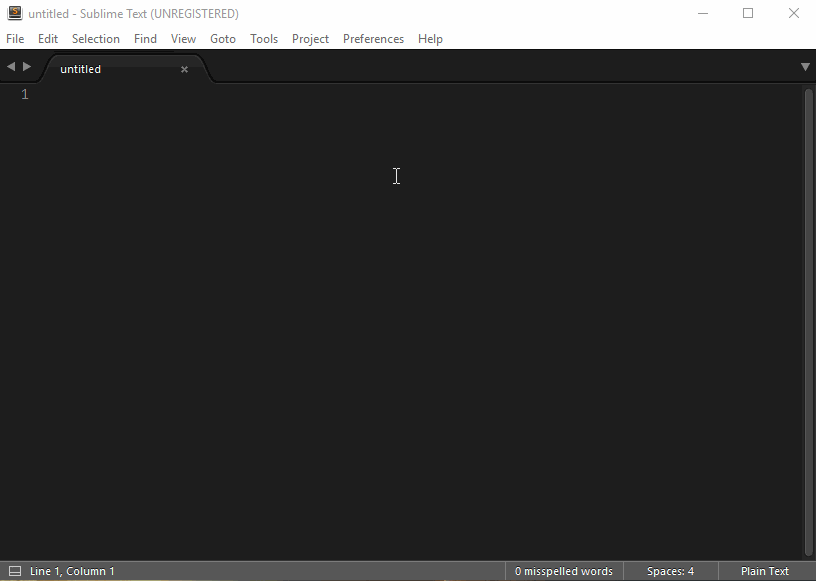
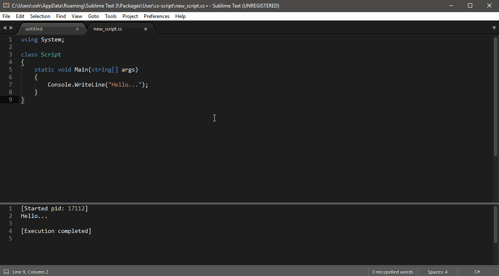
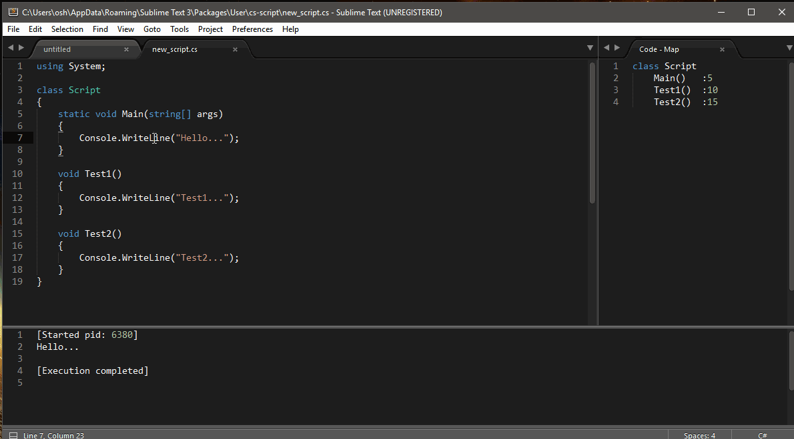
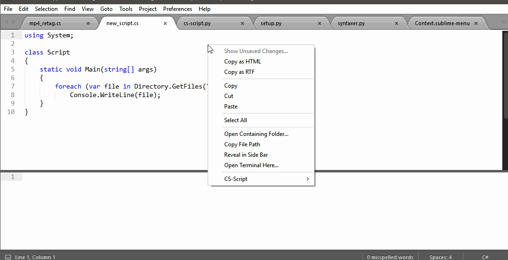

# CS-Script.ST3

CS-Script (C# intellisense) plugin for Sublime Text 3
The true C# intellisense and script execution solution based on CS-Script and Roslyn. 

*******************************************************

**Required minimum system configuration:**
 * .NET:       v4.0/4.5
 * CS-Script:  v3.19
 
*******************************************************



_More screenshots are at the end of the page._

## Installation

Note the plugin was developed and tested against ST3 but not ST2.

*__Package Control__*

The plugin is yet to be submitted to the Package Control. 

*__Manual__*

* Remove the package, if installed, using Package Control.
* Add a repository: `https://github.com/oleg-shilo/cs-script-sublime.git`
* Install `cs-script-sublime` with Package Control. 
* Restart Sublime editor if required

You can also install the plugin by cloning `cs-script-sublime` repository into your Packages folder or manually placing the download package there.

Mac users may need to do one extra step - read these [instructions](https://github.com/oleg-shilo/cs-script-sublime/wiki).

## BACKGROUND

### _Plugin_ 
The plugin allows convenient editing and execution of the C# code (scripts) directly from the editor. It brings the true C# intellisense experience that typically comes with full scale IDEs. This includes the usual "Completion suggestions", "Go to Definition", "Find all references" and many other features that can be found in Visual Studio. In the heart of the plugin are two core components CS-Script and Roslyn. 

Roslyn is an Open Source .NET code analysis and compilation service. It is the very same syntax engine that another popular intellisense solution is built around - OmniSharp. The CS-Script plugin intellisense features are quite similar to what OmniSharp can deliver except that this plugin is more tuned up for the execution of generic scripts written with C#, while OmniSharp is usually (while not always) a part of the various ASP.NET toolsets. 

### _CS-Script_ 
CS-Script is a portable Open Source CLR based scripting system, which uses ECMA-compliant C# as a programming language. It allows execution of C# code directly without the need for a dedicated compilation step. It is arguably the most mature C# scripting solution available today. It was developed in 2004, two years after the very first .NET release. And it was on the scene many years before the first public release in 2014 of MS own compilation service (Roslyn) that eventually would deliver some elements of C# scripting. 

CS-Script is enormously influenced by the Python execution model. A single script file is sufficient to execute a C# routine without dealing with any C# project infrastructure or pre-compilation of C# code. It's also possible to import/include other scripts and assemblies (DLLs). CS-Script is not an interpreted but rather a statically typed compiled environment and as such, when combined with advanced Python-like caching, it delivers an ultimate performance not comparable but identical to the performance of the fully compiled .NET application. 

## Overview

### C# 6 support on Windows

.NET/Mono comes with the C# compilers included. For .NET it was always the case until C# 6 (.NET v4.6). After that Microsoft has changed the deployment approach and .NET v4.6 includes only the older C# 5 compilers. 
Note: Mono v4.6 on Linux is immune to this problem. It still includes the the latest C# 6 compiler.

This means that on Windows the plugin (just out of box) will only support C# 5 syntax. If you want to enable support for C# 6 specific features you will need to install additional compilers - Roslyn. The easiest way to do this is to install CS-Script itself and configure the plugin to use .NET v4.6 code provider:

1. _CS-Script installation_<br> 
`choco install cs-script` (see https://github.com/oleg-shilo/cs-script/wiki)

2. _Configuration_<br>
set `useAlternativeCompiler: %CSSCRIPT_DIR%\lib\CSSCodeProvider.v4.6.DLL` with <br>
ContextMenu > CS-Script > Settings > CS-Script Config 


### C# scripting with Sublime
CS-Script ST3 plugin allows convenient editing and execution of the C# code directly from the editor. A C# script is any ECMA-compliant C# code. While any other C# based runtimes require C# code to be compiled into assemblies CS-Script allows direct C# execution by generating the assemblies on-fly. Thus you don't need to have any script specific configuration for executing your script. A single script file is fully sufficient as it contains everything that CS-Script needs to know to execute the script. 

When your C# script depend on other (source and compiled) C# source modules you can express this in your code in a very simple way via `//css_*` directives. These directives are conceptually similar to Python `import *`, which appear on top of the script. CS-Script has only a handful directives that are easy to remember. However if you forgot them you can always invoke "Show CS-Script Help" or "Show Plugin Help" command either from context menu or from "Command Palette".

Alternatively you can place the cursor on the directive (e.g. `//css_re|f`) and press F12 to trigger "Go To Definition" command to get the full information about the directive.   

And of course you can find the complete CS-Script documentation on GigHib: https://github.com/oleg-shilo/cs-script/wiki

The following is the overview of the CS-Script functionality available with Sublime Text 3. The overview also highlights the major CS-Script featured:

#### Creating a new script
Create new .cs file with a standard C# content required for .NET/Mono executable:
```C#
using System;

class Program
{
    static void Main(string[] args)
    {
        Console.WriteLine("Hello World!");
    }
}
```
CS-Script allows executing so called classless scripts, which are decorated on fly with the class infrastructure so it is compatible with the execution model required by CLR:
```C#
//css_args -ac
using System;
                     
void Main()
{
    Console.WriteLine("Hello World!";
}
```
The acceptable 'instance entry point' signatures are:
    
```
void main()
void main(string[] args)
int main()
int main(string[] args)
```
In order to enable support for classless scripts you need to add autoclass command line argument `-ac`. You can add it either to the script (with `//css_args` directive) or to the all scripts globally (via css_config file).   

#### Referencing assemblies 
Referencing assemblies with CS-Script is done with `//css_reference` (or `//css_ref`) directive. The assembly name can be a name only (for GAC assemblies) or a relative or absolute path. On Windows .NET allows discovering assemblies thus the script engine always tries to resolve the referenced namespaces (e.g. `using System.Windows.Forms`) into their assemblies and automatically reference them. Thus in the code below `MessageBox` class is available because `System.Windows.Forms.dll` assembly is referenced implicitly via "using" directive. 
```C#
//css_ref System.Core
//css_ref %shared_asms%\messages.dll

using System;
using System.Windows.Forms;

void main(string[] args)
{
    MessageBox.Show(messages.Gritting);
    ...
}
``` 
Note, implicit referencing is only available on Windows (nature of .NET). On all other platforms the assemblies need to be referenced explicitly.

You can avoid referencing the most common assemblies in every script by setting them as default referenced assemblies in the CS-Script config file (ContextMenu > CS-Script > Settings > CS-Script Config). 

#### Referencing NuGet packages
.NET offers alternative way of referencing assemblies - by referencing NuGet packages (similar to RubyGems). CS-Script allows a single step referencing for the packages with a dedicated directive:  

```C#
//css_nuget taglib
using System;
using System.IO;

...

var mp4 = TagLib.File.Create(file);
mp4.Tag.Title = episode_name;
mp4.Save();
```
Note that NuGet support will depend on the manager NuGet being install on the system. However the complete CS-Script deployment (`choco install cs-script`) on Windows already contains a copy of the nuget.exe. And many of Linux distros comes with NuGet reinstalled (though not always). 


#### Referencing/importing other scripts
Referencing other scripts is very similar to the Python concept of script importing. Though it has no packaging constrains and as such it is conceptually closer to C++ `#include`. And even name if the corresponding CS-Script directive is `//css_include` (or `//css_inc`):  

```C#
//css_inc %shared_scripts%\messages.cs
using System;

void main(string[] args)
{
    Console.WriteLine(messages.Gritting);
    ...
}
```
#### Script Execution
The plugin allows script execution directly from the editor. Just have your script active and invoke 'Execute' (F5) or 'Execute (capture output)' (Ctrl+F5). The 'capture output' option instructs the plugin to redirect the script output into the Sublime "CS-Script" output panel instead of executing the script in the external terminal. While being a convenient option 'capture output' it is logically incompatible with the scenarios when user input is expected during the script execution as the output panel does not allow user input. For such cases simple 'Execute' (F5) option is more appropriate.  

#### Probing directories
When referencing any external dependencies (e.g. scripts, assemblies) from the script, the script engine tries locate the dependency file in the "probing directories". These directories are:
- Script location
- Current directory
- Search directories from CS-Script config file (ContextMenu > CS-Script > Settings > CS-Script Config).
- Search directories defined in the script with `//css_dir` directive.

`//css_dir` directive is a convenient way to define a script specific locations. It supports environment variables as well as absolute and relative paths:
```C#
//css_dir %includs%
//css_dir %libs%
//css_inc messages.cs
//css_ref utils.dll

using System;

void main(string[] args)
{
    Console.WriteLine(utils.ToGerman(messages.Gritting));
    ...
}
``` 

#### Debugging
You can easily debug scripts being executed by attaching the system default debugger to the running process (script). The most convenient way of doing this is to place assert in the script code and follow the assertion prompt for attaching the debugger. If you are executing the script from CLI then you can specify the `//x` as the last parameter to trigger the assertion on the script startup.
```
cscs.exe my_script.cs //x 
```
Note, the availability and functionality of the system default debugger depends on the system configuration and the  operating system itself.

However sometimes using the full scale debugger may be inconvenient. In such cases you can use a built-in "debug print" functionality, which is very similar to Python `print` statement:
```C#
using System;

void main()
{
    dbg.print(DateTime.Now);
}
```
Or using C#6 syntax:
```C#
using System;
using static dbg;

void main()
{
    print(DateTime.Now);
}
```
And this is how the `print` output looks like:
```
{22/02/2017 1:08:13 PM}
  .Date = {22/02/2017 12:00:00 AM}
  .Day = 22
  .DayOfWeek = Wednesday
  .DayOfYear = 53
  .Hour = 13
  .Kind = Local
  .Millisecond = 246
  .Minute = 8
  .Month = 2
  .Second = 13
  .Ticks = 636233656932466653
  .TimeOfDay = 13:08:13.2466653
  .Year = 2017
```

#### Show project
Any script file is sufficient and contains all the information required for the execution. The script at runtime is unfolded into the virtual project containing all dependencies resolved (referenced assemblies, imported scripts, probing directories). This project is a complete execution context that sometimes is beneficial to know. You can access this context by executing plugin's `csscript_load_proj` (Ctrl+F7) command. This command prints the all virtual project details:
```
file: E:\Dev\test.cs
ref: C:\WINDOWS\...\System.Core.dll
ref: C:\WINDOWS\...\System.Text.RegularExpressions.dll
ref: C:\WINDOWS\...\System.Windows.Forms.dll
ref: C:\WINDOWS\...\System.dll
searcDir: C:\ProgramData\chocolatey\lib\cs-script\tools\cs-script\lib
searcDir: C:\ProgramData\CS-Script\inc
searcDir: E:\Dev
```

#### Global configuration
The plugin behavior can be adjusted in the usual way as for all other Sublime plugins by editing the settings files.
And for the CS-Script settings can be accessed via context menu: CS-Script > Settings > CS-Script Config   

#### Building executables
CS-Script allows converting a script into a self-sufficient executable. It is in fact quite straightforward process. CS-Script is not an interpreter as many other scripting solution but an execution environment, which converts C# (or VB) file into assembly on-fly. And as long as the assembly is compiled as an executable it can be executed on its own without the need for the script engine any more. 

You can invoke "Build exe" command either from the context menu or from command palette.   

#### Coding assistance services
Thanks to the fact the .NET runtime is a true type system, the type context is fully deterministic for any location in the source code. This means that for C# code as well as some other 'type system' based environments (e.g. Java) coding assistance services can deliver an extremely high level of user experience that is impossible for dynamic languages (e.g. JavaScript).

CS-Script plugin comes with the following coding assistance services:

- Code completion.
Invoked automatically on typing "." or by shortcut `Ctrl+Space`. The user experience is very similar to Intellisense that many developers are familiar with from working with Visual Studio.

- Go to definition.
Invoked by shortcut `F12` or via context menu. It navigated to the definition of  the symbol under the cursor.

- Find references.
Invoked by shortcut `Shift+F12` or via context menu. It prints on output panel all locations (including imported scripts) of the code where the symbol under the cursor is referenced (used).

- Check syntax.
Invoked by shortcut `F7` or via context menu. It checks the whole code  on output panel all locations of the code where the symbol under the cursor is referenced (used).
Double-clicking the error in the output panel navigates to the error location in the source code. You can jump to the next error with `F4`. 

- Add missing usings.
It tries to resolve the error caused by missing `using...` directive(s). This command can be invoked by shortcut `Ctrl+.` when the cursor is placed on the word causing the compiling error. Alternatively you can hover over the word with error and this wold bring a tooltip with the error description. The tooltip is interactive and clicking the tooltip also invokes the command.

- Format.
Invoked by shortcut `F8` or via context menu. It formats the code code according default formatting style provided by Roslyn.

#### Help
The help resources are available in form of plugin documentation and online. Use either context menu to open either plugin or CS-Script help file. For the online documentation see CS-Script GitHub Wiki: https://github.com/oleg-shilo/cs-script/wiki.

#### CLI
The plugin provides access only to the part of the CS-Script functionality. If you need to to access the features that are not exposed via the plugin interface (e.g. converting script into assembly/dll) you may want to use CS-Script command line interface (CLI) from the terminal. Command-prompt on Windows and Bash on Linux. Sublime has quite a few plugins for integrating terminal with the editor. One of them "Terminal" seems to be quite fit for the task.
The CS-Script CLI user guide can be found here: https://github.com/oleg-shilo/cs-script/wiki/CLI---User-Guide

#### Plugin config
The pluging settings can be accessed via Preferences > Package Settings > CS-Script.

These are the settings values that can help to adjust the user experience according your preferences:

- auto_trigger_autocomplete <br>
Controls automatic triggering completion suggestion on typing '.' after a word.

- auto_trigger_tooltip <br>
Controls automatic triggering member/signature tooltip suggestion on typing '(' after a word.

- auto_tooltip_light_content <br>
Indicates if the automatic tooltip should have lighter appearance comparing to the tooltip triggered by hovering over the word. Useful to make the tooltip less obstructive by omitting some of the tooltip content.

- error_strong_appearance <br>
All syntax errors by default are highlighted ST3 error scope style. Using this setting can soften the appearance of the error(s) 

- format_on_save <br>
Format the code on saving.

- syntaxcheck_on_save <br>
Check code syntax on saving.

- 'server_port' <br>
The plugin communicates with the Syntaxer (module responsible for C# syntax parsing) via local socket (localhost:18000). If for whatever reason the port choice is no appropriate/convenient you can change it by adjusting this setting. If you do so you will need to restart Sublime. 

----
_Finding a symbol definition_


_Finding all references to a symbol under the cursor._


_Formatting code_


_Automatically adding missing `using` directives._



